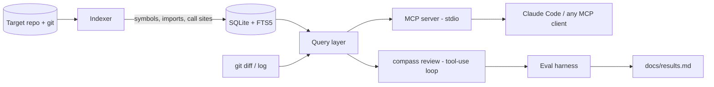

# repo-compass — Build Plan

## One-line pitch
An MCP server that gives coding agents (Claude Code, etc.) structural understanding of a codebase
(symbols, references, module dependencies, diff impact, hotspots), plus an agent CLI built on it
and an eval harness that measures, with numbers, whether the tools beat plain grep-and-read.

## Why this project
- AI + developer tooling: MCP server design, agent tool-use loop, evals. These are the skills AI-systems and agent-infrastructure roles hire for.
- Real engineering: parsing, indexing, incremental updates, git integration, CLI, packaging, CI.
- A defensible claim backed by data ("X% fewer tokens / tool calls on Y tasks") instead of "I built a wrapper".
- Not QA-focused. Not a knowledge-management platform. It is agent tooling plus measurement.

## Scope
In scope (v0.1): Java and Python indexing, 7 MCP tools, `compass review` agent, eval harness, packaging, docs.
Non-goals: IDE plugin, web UI, cloud service, full type-accurate call resolution, languages beyond Java/Python (stretch: TypeScript).

## Architecture


## Repo layout (target)
```
repo-compass/
  src/compass/
    indexer/      # walk, parse (tree-sitter), extract, store
    store/        # sqlite schema, queries, incremental logic
    tools/        # query layer: pure functions, no MCP imports
    server.py     # MCP wiring only
    agent/        # review agent loop
    cli.py
  evals/
    tasks/*.yaml  # questions + verified answers
    runner.py
    report.py
  tests/  fixtures/
  docs/adr/  docs/results.md
  .github/workflows/ci.yml
  README.md  CLAUDE.md  PLAN.md
```
Design rule: `tools/` is pure and unit-testable; `server.py` and `agent/` are thin adapters over it.

## Milestones
Each milestone lists tasks and acceptance criteria (AC). Do not start the next until AC pass and CI is green.

### M0 — Scaffold (1-2 days)
- uv project, package skeleton, ruff, pytest, pre-commit optional
- GitHub Actions: lint + tests on push/PR
- README stub, LICENSE (MIT), .gitignore
- ADR-001: language/stack choice; ADR-002: SQLite over a graph DB
- AC: `uv run pytest` and lint pass locally and in CI; fresh clone works with `uv sync`.

### M1 — Indexer (week 1)
- Walk repo respecting .gitignore; skip binaries and vendored dirs
- Parse Java and Python with tree-sitter; extract: classes, methods/functions, fields (Java), imports, and call sites (callee name + location)
- Store in SQLite: files(hash, mtime), symbols, imports, references; FTS5 index over symbol names
- Incremental reindex: only files whose content hash changed; delete rows for removed files
- CLI: `compass index <path>`, `compass symbol <name>`
- Reference resolution: name-based plus import/package heuristics. Document precision limits in an ADR.
- AC: indexes a ~50k LOC repo in under 15s cold; re-index after touching one file touches only that file (test asserts this); fixtures cover Java and Python edge cases (overloads, nested classes, decorators, static imports).

### M2 — MCP server (week 2)
Tools (all read-only, size-capped, truncation marker included):
1. `repo_summary` — languages, top-level modules, size, index freshness
2. `search_symbols(query, kind?, limit)` — FTS search
3. `get_symbol(id | qualified_name)` — signature, location, docstring/comment, body snippet (capped)
4. `find_references(symbol)` — callers/usages with file:line and one-line context
5. `file_outline(path)` — symbols in a file without reading it
6. `module_dependencies(module?)` — import graph edges, cycle detection
7. (M3) `diff_impact` and `hotspots`
- Structured, compact output formats. Output token budget is a first-class design constraint.
- Server refreshes the index lazily (checks hashes on tool call, bounded time).
- Docs: `claude mcp add repo-compass -- uv run compass serve --repo .`
- AC: in-process MCP client tests for each tool; works end to end in Claude Code against a real repo; every tool response under its documented cap.

### M3 — Git-aware tools (week 2-3)
- `diff_impact(base, head)`: changed symbols, their direct callers, modules touched, files that import touched modules. Ranked, capped.
- `hotspots(since, limit)`: churn (commits touching file) x complexity proxy (symbol count / length), with how it is scored documented.
- AC: tests on a scripted temp git repo with known history; results deterministic.

### M4 — Review agent (week 3)
- `compass review --base main --head HEAD`: Anthropic tool-use loop that calls compass tools and produces a markdown PR review (risks, missing tests to consider, breaking-change candidates).
- Controls: max turns, max tokens, hard cost cap, `--no-tools` baseline mode (diff only), `--model` flag (default via env `COMPASS_MODEL`).
- Every run logs: turns, tool calls, input/output tokens, wall time (JSON lines) for the eval harness.
- AC: deterministic loop tests with a mocked client; a real run on a sample PR completes under the cost cap and logs metrics.

### M5 — Eval harness (week 3-4)  <- the differentiator
- Task format (YAML): repo + commit, question, verified answer or rubric, category
  (locate, trace-callers, impact-of-change, dependency-question).
- 25-40 tasks across 3 repos: the owner's own microservices project plus two permissively licensed OSS repos (one Java, one Python). Answers verified by hand.
- Conditions: (A) agent with plain file read + grep tools, (B) agent with compass tools. Same model, same limits.
- Metrics: correctness (exact/rubric, optionally LLM-judge with spot-checked human validation), input tokens, tool calls, wall time. N>=3 runs per task; report mean and spread.
- `docs/results.md` auto-generated: table, per-category breakdown, failure analysis, threats to validity.
- AC: `uv run python -m evals.runner --all` reproduces results; report includes cases where compass did NOT help. Do not tune tasks to flatter the tool.

### M6 — Ship (week 4)
- README: problem, 30-second demo GIF, install, Claude Code setup snippet, tool reference, architecture diagram, headline results table, limitations, roadmap
- Publish to PyPI (or document `uvx --from git+https://...`), tag v0.1.0, GitHub release notes
- ADRs finalized (owner rewrites key ones in their own words)
- Short write-up draft (docs/writeup.md): what was built, what the numbers showed, what surprised us
- AC: fresh machine can install and connect in under 5 minutes following only the README.

## Definition of done (whole project)
- CI green, tests meaningful, no secrets, no employer content
- Results published honestly with method
- Owner can whiteboard the architecture and defend every ADR without notes

## Suggested schedule (2-3 hrs/week alongside interview prep)
Week 1: M0 + M1 | Week 2: M2 (+ start M3) | Week 3: M3 + M4 | Week 4: M5 + M6.
If time slips, cut in this order: TypeScript stretch, hotspots, LLM-judge. Never cut M5.

## Kickoff prompt (paste into Claude Code after copying these files into a new git repo)
Read CLAUDE.md and PLAN.md fully. Use plan mode. We are doing M0 only. Propose a concrete task list
and the file tree you will create, list any decisions you need from me, then wait for approval before writing code.
After M0 passes its acceptance criteria, stop and summarize what you did and any ADRs written.
